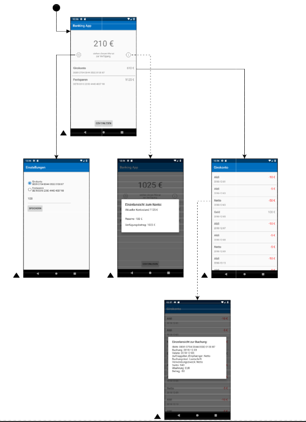

# Android App

Die Android App entstand im Praktikum des Moduls Nutzerzentrierte Softwareentwicklung. Auf der Startseite bietet die App dem Nutzer eine Kontoübersicht, sowie einen im aktuellen Monat zur Verfügung stehenden Betrag. Dieser setzt sich aus folgender Berechnung zusammen.

**Aktueller Kontostand - Fixe Buchungen - einen seperat festgelegten Betrag, den das Konto nicht unterschreiten darf**.

Fixe Buchungen könnnen beispielsweise Daueraufträge sein, welche im laufenden Monat noch anstehen. 
Über den 'CSV Einlesen' Button hat der User die Möglichkeit, seine von der Bank exportierte CSV in die App hochzuladen und so die Buchungen zu aktualisieren. 

In Detailansichten hat der User die Möglichkeit, eine Liste seiner Abbuchungen einzusehen. Klickt ein Benutzer auf einen Listeneintrag, erhält er nähere Informationen zu dem entsprechenden Eintrag.

In den Settings kann der Benutzer das jeweilige Konto, von dem der zur Verfügung stehende Betrag ermittelt werden soll festgelegt werden. Weiterhin kann er seine "eiserne Reservere" einzutragen. 

# Navigationsübersicht

Weitere Infos zum Projekt können aus der [Projektdokumenation](/doc/Dokumentation.pdf) entnommen werden. 
